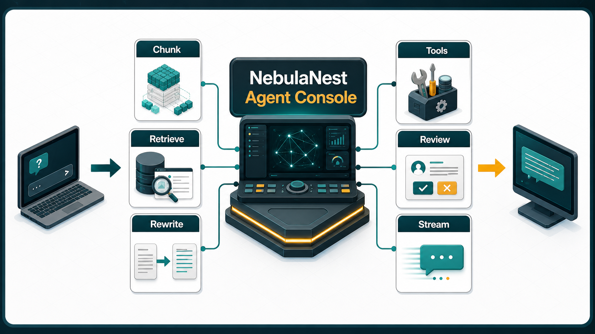

# NebulaNest Agent Console

NebulaNest（星巢智能体控制台）是一个本地运行的 Agent + RAG 工作台。它把文档入库、混合检索、查询改写、工具调用、运行回调和人工审核放在同一个控制台里，适合做企业知识库问答、课程资料检索、客服辅助和可追踪的智能体实验。



## 项目亮点

- 流式 Agent 对话：`/chat/stream` 通过 SSE 返回增量回答、RAG 步骤和最终 trace。
- 本地知识库：上传 PDF、Word、PPT、Excel、CSV、TXT 后写入 Milvus。
- 分层 RAG：L3 叶子块进入向量库，L1/L2 父块进入本地 DocStore，检索后支持 auto-merging。
- 混合检索：Dense embedding + BM25 sparse embedding + Milvus Hybrid Search，并用 RRF 融合。
- 查询扩展：相关性不足时进入 LangGraph 节点，自动选择 Step-back、HyDE 或复杂组合策略。
- 可选重排：支持接入 SiliconFlow rerank。
- 可选 RAGFlow：外部召回结果可与本地 Milvus 结果融合去重。
- MCP 地图工具：DashScope AMap MCP 使用独立的 `DASHSCOPE_MCP_API_KEY`。
- 运行回调：MCP、天气、RAGFlow、Milvus 等失败会记录到 `data/tool_failures.json`，前端可重试或标记解决。
- 人工审核：可把回答提交到审核队列，支持批准、驳回和修订。

## 技术栈

- 后端：FastAPI、Uvicorn、LangChain、LangGraph、Pydantic。
- Agent 工具：LangChain tools、langchain-mcp-adapters、DashScope MCP。
- 向量库：Milvus standalone、MinIO、etcd。
- 检索：DashScope text embedding、Milvus Hybrid Search、BM25 sparse vector、RRF、可选 rerank。
- 文档解析：`document_loader.py` 支持 PDF、Office、CSV、TXT 等格式。
- 前端：Vue 3 CDN、SSE、Marked、Highlight.js、Font Awesome。

## 目录结构

```text
backend/
  app.py                  FastAPI 应用入口
  api.py                  总路由聚合
  routes_*.py             聊天、会话、文档、审核、回调路由
  agent.py                Agent 初始化和同步/流式对话
  mcp_service.py          DashScope AMap MCP 加载与工具封装
  settings.py             统一读取环境变量
  embedding.py            Dense embedding + BM25 sparse embedding
  milvus_client.py        Milvus 集合、查询、混合检索和自动重连
  rag_utils.py            本地/RAGFlow 检索编排
  rag_pipeline.py         LangGraph RAG 主流程
  rag_expanded.py         扩展查询后的多路召回节点
  query_expansion.py      Step-back 与 HyDE
  retrieval_steps.py      Rerank、auto-merging、去重
  ragflow_client.py       可选 RAGFlow retrieval adapter
frontend/
  index.html              单页控制台
  script.js               Vue 挂载入口
  js/*.js                 前端状态、聊天、知识库、审核、格式化逻辑
  style.css               样式入口
  css/*.css               拆分后的样式模块
docs/assets/
  nebulanest-flow.png     README 逻辑总览图
data/
  documents/              上传文件，本地运行数据，默认不提交
  parent_chunks.json      L1/L2 父块存储，默认不提交
  tool_failures.json      工具失败与回调记录，默认不提交
docker-compose.yml        Milvus 依赖服务
```

## 运行流程

### 1. 文档入库

用户在前端知识库页上传文件，后端先保存原始文件，再由 `DocumentLoader` 解析文本。解析结果会生成 L1/L2/L3 三层块：父块保存在 `parent_chunks.json`，叶子块生成 dense embedding 和 sparse embedding 后写入 Milvus。这样既能检索到精确片段，也能在回答时上卷到更完整的上下文。

### 2. 对话与检索

前端把问题提交到 `/chat/stream`，`agent.py` 调用 LangChain Agent。Agent 根据问题选择本地知识库、天气、AMap MCP 或其他工具。知识库检索会先走 Milvus Hybrid Search，并可融合 RAGFlow 结果；如果相关性评估不足，LangGraph 会触发查询改写，再用 Step-back、HyDE 或复杂查询策略补召回。

### 3. 回答生成

检索结果会经过去重、可选 rerank 和 auto-merging。最终上下文交给模型生成回答，前端通过 SSE 实时显示回答内容、检索步骤、引用片段和 trace 信息。

### 4. 质量闭环

回答可以提交人工审核；工具或外部服务失败会进入运行回调队列。管理员可在前端把失败项标记为重试、已解决或忽略，避免静默失败。

## 环境变量

复制 `.env.example` 为 `.env`，再填入真实 Key。不要把真实 `.env` 提交到仓库。

```env
CHAT_MODEL=deepseek-v4-flash
CHAT_API_KEY=...
CHAT_BASE_URL=https://api.deepseek.com
QUERY_EXPANSION_MODEL=deepseek-v4-flash

DASHSCOPE_MCP_API_KEY=...
AMAP_MCP_ENDPOINT=https://dashscope.aliyuncs.com/api/v1/mcps/amap-maps/mcp

DASHSCOPE_EMBEDDING_API_KEY=...
DASHSCOPE_BASE_URL=https://dashscope.aliyuncs.com/compatible-mode/v1
DASHSCOPE_EMBEDDING_MODEL=text-embedding-v3

RERANK_MODEL=BAAI/bge-reranker-v2-m3
RERANK_BINDING_HOST=https://api.siliconflow.cn/v1/rerank
RERANK_API_KEY=...

AMAP_API_KEY=...
MILVUS_HOST=127.0.0.1
MILVUS_PORT=19530
MILVUS_COLLECTION=embeddings_collection
```

Key 职责：

- `CHAT_API_KEY`：主对话模型与查询扩展。
- `DASHSCOPE_MCP_API_KEY`：高德地图 MCP，只用于 `mcp_service.py`。
- `DASHSCOPE_EMBEDDING_API_KEY`：向量模型，只用于 `embedding.py`。
- `RERANK_API_KEY`：重排模型，只用于 `retrieval_steps.py`。
- `AMAP_API_KEY`：高德天气 REST API，不等于 MCP Key。

## 启动

1. 安装依赖：

```powershell
uv sync
```

2. 启动 Milvus 依赖：

```powershell
docker compose up -d
```

3. 启动后端和前端静态页：

```powershell
cd backend
..\.venv\Scripts\python.exe app.py
```

4. 打开控制台：

```text
http://127.0.0.1:8000
```

Attu 管理界面默认地址：

```text
http://127.0.0.1:8080
```

后端默认使用 `8000`，避免与 `docker-compose.yml` 中 Attu 的 `8080` 冲突。需要修改时设置 `PORT`。

## 常见问题

### 终端显示 Agent 初始化完成，但前端仍有 `amap_mcp_init`

先看终端是否显示 MCP 工具已加载。如果显示 MCP 未加载到工具，说明 Agent 本体启动成功，但 DashScope MCP 没拿到工具。重点检查：

- `DASHSCOPE_MCP_API_KEY` 是否是开通 MCP 的 Key。
- `AMAP_MCP_ENDPOINT` 是否正确。
- 百炼控制台里的 AMap MCP 是否已开通，或是否需要重新开通升级协议。

### Milvus 报 `closed channel`

`milvus_client.py` 已支持 `closed channel` 自动重连并重试一次。若仍失败，检查 Milvus 容器健康状态：

```powershell
docker ps
```

### 上传成功但搜索不到

检查：

- `DASHSCOPE_EMBEDDING_API_KEY` 是否有 embedding 额度。
- Milvus `19530` 是否可用。
- 上传文档是否生成 L3 叶子块。
- `MILVUS_COLLECTION` 是否与当前服务一致。

## 开发约定

- 后端单文件尽量保持在 250 行以内。
- 前端 JS/CSS 已按功能拆分，`script.js` 和 `style.css` 只保留入口。
- 不要在业务代码中硬编码真实 Key，只通过 `.env` 读取。
- 工具失败不要静默丢弃，统一记录到 `tool_failures.json`。
- `data/`、`volumes/`、`.env`、`.venv/` 默认不提交，避免泄露运行数据和凭据。
