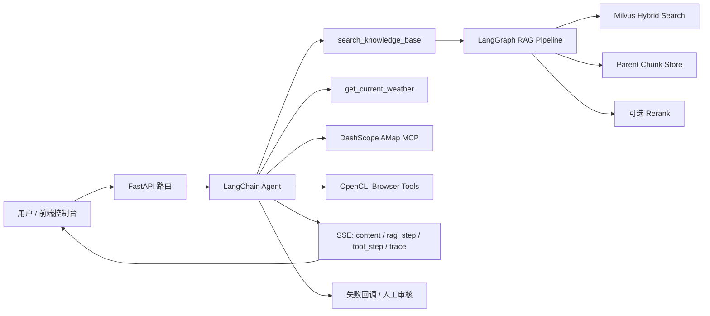

# Agent Console

Agent Console 是一个本地运行的 Agent + RAG 工作台。它把文档入库、混合检索、查询改写、工具调用、浏览器自动化、运行回调和人工审核放在同一个控制台里，适合做企业知识库问答、课程资料检索、客服辅助和可追踪的智能体实验。


## 核心能力

- 流式对话：`/chat/stream` 通过 SSE 返回增量回答、RAG 步骤、工具调用步骤和最终 trace。
- 可视化工具流程：普通工具、MCP 工具、RAG 检索都会在前端展示调用参数、当前阶段和返回摘要。
- 本地知识库：支持上传 PDF、Word、PPT、Excel、CSV、TXT，解析后写入 Milvus。
- 分层 RAG：L1/L2 父块保存在本地 DocStore，L3 叶子块进入向量库，回答时支持 auto-merging 上卷上下文。
- 混合检索：BGE-M3 dense embedding + BM25 sparse embedding + Milvus Hybrid Search，并用 RRF 融合。
- 查询扩展：相关性不足时进入 LangGraph 节点，自动选择 Step-back、HyDE 或复杂组合策略。
- 可选重排：支持接入 SiliconFlow rerank。
- 地图与天气工具：DashScope AMap MCP 用于路线、POI、地址与坐标；高德 REST API 用于实时天气。
- OpenCLI 浏览器工具：可通过用户浏览器打开网页、读取页面状态、点击、输入、抽取内容和查看网络请求。
- 运行回调：MCP、OpenCLI、天气、Milvus 等失败会记录到 `data/tool_failures.json`，前端可重试或标记解决。
- 人工审核：可把回答提交到审核队列，支持批准、驳回和修订。

## 技术栈

- 后端：FastAPI、Uvicorn、LangChain、LangGraph、Pydantic。
- Agent 工具：LangChain tools、langchain-mcp-adapters、DashScope MCP、OpenCLI。
- 向量库：Milvus standalone、MinIO、etcd。
- 检索：BGE-M3、Milvus Hybrid Search、BM25 sparse vector、RRF、可选 rerank。
- 文档解析：PyMuPDF、pypdf、python-docx、python-pptx、docx2txt。
- 前端：Vue 3 CDN、SSE、Marked、Highlight.js、Font Awesome。

## OpenCLI 在本项目中的定位

[OpenCLI](https://github.com/jackwener/OpenCLI) 是一个面向网站和浏览器自动化的 CLI 工具层。它可以把网站、已登录的 Chrome/Chromium 浏览器会话、Electron 应用和本地 CLI 包装成可调用接口，让人或 AI Agent 用稳定命令完成打开页面、读取 DOM、点击、输入、等待、抽取内容和查看网络请求等操作。

本项目没有直接把浏览器自动化逻辑写进 Agent，而是通过 `backend/opencli_tools.py` 把 OpenCLI 封装成 LangChain tools：

- Agent 需要访问网页或读取实时网页内容时，可以调用 `browser_open`、`browser_state`、`browser_extract` 等工具。
- OpenCLI 复用用户自己的浏览器登录态，适合查询 Bilibili 热门、网页列表、后台页面等需要真实浏览器上下文的任务。
- 工具执行失败会进入 `tool_failures.json` 和前端“运行回调”，不会让一次浏览器失败静默丢失。
- 每一次 OpenCLI 工具调用都会通过 SSE 展示在对话流程里，用户能看到调用参数、执行阶段和返回摘要。

## 架构流程



## 目录结构

```text
backend/
  app.py                  FastAPI 应用入口，挂载前端静态文件
  api.py                  总路由聚合
  routes_*.py             聊天、会话、文档、审核、回调路由
  agent.py                Agent 初始化和同步/流式对话
  agent_prompt.py         Agent 系统提示词
  tools.py                本地天气、知识库检索和步骤事件队列
  tool_instrumentation.py 工具调用步骤包装器
  mcp_service.py          DashScope AMap MCP 加载与工具封装
  opencli_tools.py        OpenCLI 浏览器自动化工具封装
  settings.py             统一读取环境变量
  document_loader.py      文档解析和分层切块
  embedding.py            Dense embedding + BM25 sparse embedding
  milvus_client.py        Milvus 集合、查询、混合检索和自动重连
  parent_chunk_store.py   L1/L2 父块本地存储
  rag_utils.py            本地混合检索编排
  rag_pipeline.py         LangGraph RAG 主流程
  rag_expanded.py         扩展查询后的多路召回节点
  query_expansion.py      Step-back 与 HyDE
  retrieval_steps.py      Rerank、auto-merging、去重
frontend/
  index.html              单页控制台
  script.js               Vue 挂载入口
  js/*.js                 前端状态、聊天、知识库、审核、格式化逻辑
  style.css               样式入口
  css/*.css               拆分后的样式模块
docs/assets/
  nebulanest-flow.png     README 逻辑总览图
data/
  documents/              上传文件，本地运行数据，默认不提交
  parent_chunks.json      L1/L2 父块存储，默认不提交
  tool_failures.json      工具失败与回调记录，默认不提交
docker-compose.yml        Milvus、MinIO、etcd、Attu 依赖服务
```

## 环境要求

- Python 3.12+
- Node.js >= 20，用于 OpenCLI CLI 和浏览器自动化
- uv
- Docker Desktop
- 可用的模型 API Key
- OpenCLI 和 Browser Bridge 扩展，用于访问用户自己的浏览器会话

安装依赖：

```powershell
uv sync
```

安装 OpenCLI：

Windows/macOS 本地使用也可以优先安装 OpenCLIApp，它会内置 OpenCLI runtime，并提供环境诊断、更新和浏览器登录态保活能力。纯 CLI、CI 或服务器环境可使用 npm 全局安装：

```powershell
node --version
npm install -g @jackwener/opencli
opencli doctor
```


启动 Milvus 依赖：

```powershell
docker compose up -d
```

查看容器状态：

```powershell
docker ps
```

## 环境变量

复制 `.env.example` 为 `.env`，再填入真实 Key。不要把真实 `.env` 提交到仓库。

```env
# Chat model
CHAT_MODEL=deepseek-v4-flash
CHAT_API_KEY=...
CHAT_BASE_URL=https://api.deepseek.com
QUERY_EXPANSION_MODEL=deepseek-v4-flash

# DashScope MCP (AMap/Gaode tools only)
DASHSCOPE_MCP_API_KEY=...
AMAP_MCP_ENDPOINT=https://dashscope.aliyuncs.com/api/v1/mcps/amap-maps/mcp

# BGE embeddings
EMBEDDING_MODEL=BAAI/bge-m3
EMBEDDING_DEVICE=cpu
EMBEDDING_DIM=1024
EMBEDDING_BATCH_SIZE=16
BM25_STATE_PATH=

# Rerank
RERANK_MODEL=BAAI/bge-reranker-v2-m3
RERANK_BINDING_HOST=https://api.siliconflow.cn/v1/rerank
RERANK_API_KEY=...

# AMap weather REST API
AMAP_WEATHER_API=https://restapi.amap.com/v3/weather/weatherInfo
AMAP_API_KEY=...

# Milvus
MILVUS_HOST=127.0.0.1
MILVUS_PORT=19530
MILVUS_COLLECTION=embeddings_bge_m3
MILVUS_DENSE_DIM=1024

# Optional OpenCLI browser automation
OPENCLI_BIN=
OPENCLI_SESSION=lcagent
OPENCLI_TIMEOUT=75
OPENCLI_OUTPUT_MAX_CHARS=12000
```

### Key 职责

| 变量 | 用途 |
| --- | --- |
| `CHAT_API_KEY` | 主对话模型与查询扩展。 |
| `DASHSCOPE_MCP_API_KEY` | 高德地图 MCP，只用于 `mcp_service.py`。 |
| `RERANK_API_KEY` | 重排模型 Key，只用于 rerank。 |
| `EMBEDDING_*` | BGE embedding 配置，默认模型 `BAAI/bge-m3`，默认维度 `1024`。 |
| `BM25_STATE_PATH` | 可选，BM25 词表与 df 统计持久化路径；默认 `data/bm25_state.json`。 |
| `AMAP_API_KEY` | 高德天气 REST API，不等于 MCP Key。 |
| `OPENCLI_BIN` | 可选，显式指定 OpenCLI 可执行文件，例如 `C:\Users\wangy\AppData\Roaming\npm\opencli.cmd`。 |
| `OPENCLI_SESSION` | OpenCLI 浏览器会话名，默认 `lcagent`。 |

## 启动应用

推荐在开发时显式使用 `PORT=8000`：

```powershell
$env:PORT="8000"
cd backend
..\.venv\Scripts\python.exe app.py
```

打开控制台：

```text
http://127.0.0.1:8000
```

常用本地服务：

| 服务 | 地址 |
| --- | --- |
| Agent Console | `http://127.0.0.1:8000` |
| Milvus gRPC | `127.0.0.1:19530` |
| Attu 管理界面 | `http://127.0.0.1:8083` |
| MinIO API | `http://127.0.0.1:9008` |
| MinIO Console | `http://127.0.0.1:9081` |

说明：`backend/app.py` 未设置 `PORT` 时会使用 `8080`。为了避免和其他本地服务混淆，建议开发时显式设置 `PORT=8000`。

## 主要页面

- 对话：流式回答、工具步骤、RAG trace、引用片段、提交人工审核。
- 知识库：上传文档、入库、查看文档块数量、删除文档。
- 人工审核：查看待审回答，批准、驳回或填写修订稿。
- 运行回调：查看工具失败记录，标记重试、已处理或忽略。
- 历史会话：按用户和 session 读取历史消息。

## 主要 API

| 方法 | 路径 | 说明 |
| --- | --- | --- |
| `POST` | `/chat/stream` | SSE 流式对话，返回 `content`、`rag_step`、`tool_step`、`trace`。 |
| `POST` | `/chat` | 非流式对话。 |
| `GET` | `/sessions/{user_id}` | 获取用户会话列表。 |
| `GET` | `/sessions/{user_id}/{session_id}` | 获取会话消息。 |
| `POST` | `/documents/upload` | 上传文档并入库。 |
| `GET` | `/documents` | 查看已入库文档。 |
| `DELETE` | `/documents/{filename}` | 删除文档。 |
| `GET` | `/reviews` | 查看人工审核列表。 |
| `POST` | `/reviews` | 提交回答到人工审核。 |
| `GET` | `/tool-failures` | 查看工具失败回调。 |
| `PATCH` | `/tool-failures/{failure_id}` | 更新失败回调状态。 |

## 运行流程

### 1. 文档入库

用户在知识库页上传文件，后端先保存原始文件，再由 `DocumentLoader` 解析文本。解析结果会生成 L1/L2/L3 三层块：父块保存在 `parent_chunks.json`，叶子块生成 BGE dense embedding 和 BM25 sparse embedding 后写入 Milvus。BGE 模型和 Milvus client 都采用懒加载，应用启动时不会预加载向量模型。

### 2. 对话与工具选择

前端把问题提交到 `/chat/stream`，`agent.py` 调用 LangChain Agent。Agent 根据问题选择本地知识库、天气、AMap MCP、OpenCLI 浏览器工具或其他工具。每次工具调用都会被 `tool_instrumentation.py` 包装为用户可见的步骤事件。

### 3. RAG 检索与生成

知识库检索会先走 Milvus Hybrid Search：BGE dense 向量和 BM25 sparse 向量分别召回候选，再用 RRF 融合。候选返回后先做 auto-merging 上卷，再用可选 rerank 重新打分排序。如果没有搜到片段，或相关性评估不通过，LangGraph 才会触发查询改写，再用 Step-back、HyDE 或复杂查询策略补召回。最终检索结果会交给模型生成回答。

### 4. 质量闭环

回答可以提交人工审核；工具或外部服务失败会进入运行回调队列。管理员可在前端把失败项标记为重试、已解决或忽略，避免静默失败。

## OpenCLI 浏览器自动化

OpenCLI 工具适合处理需要访问网页、读取当前页面、抽取热门内容或分析网络请求的任务。它的工作方式是：本地 `opencli` 命令连接 OpenCLI daemon，再通过 Browser Bridge 扩展控制 Chrome/Chromium 页面。本项目中的 Agent 只调用后端封装好的工具，不直接拼接浏览器脚本。

本项目封装的 OpenCLI 工具：

- `opencli_doctor`：检查 OpenCLI daemon 和 Browser Bridge 扩展连接状态。
- `browser_open`：打开 URL。
- `browser_state`：读取页面结构化快照和可操作 refs。
- `browser_click`：点击页面元素。
- `browser_type`：向输入框输入文本。
- `browser_extract`：从当前页面抽取信息。
- `browser_network`：查看最近网络请求。
- `browser_wait`：等待页面文本、选择器、XHR、下载或时间。

典型调用顺序：

1. `opencli_doctor` 检查环境。
2. `browser_open` 打开目标页面。
3. `browser_state` 读取页面结构和可操作 refs。
4. 根据任务使用 `browser_click`、`browser_type`、`browser_wait` 或 `browser_extract`。
5. 再次用 `browser_state` 或抽取结果验证页面变化。

建议手动验证环境：

```powershell
opencli doctor
```

官方常用命令示例：

```powershell
opencli list
opencli bilibili hot --limit 5
opencli browser lcagent open https://www.bilibili.com
opencli browser lcagent state
```

Windows 注意事项：

- npm 全局安装通常会生成 `opencli.cmd`。
- URL 中的 `&` 在 `cmd.exe` 中是命令分隔符，直接拼接命令会导致类似 `'pn' 不是内部或外部命令` 的错误。
- 本项目会优先解析 `opencli.cmd` 背后的 Node 入口，直接执行 OpenCLI 的 JS 主程序，避免 URL 参数被 `cmd.exe` 拆开。

安全边界：

- 登录、付款、发布、发消息、关注/取关、删除等有副作用操作需要先获得用户确认。
- 不绕过验证码、付费墙、权限控制或网站风控。
- 浏览器工具失败时，Agent 应说明限制，并避免用同一参数反复重试。

## 常见问题

### 终端显示 Agent 初始化完成，但前端仍有 `amap_mcp_init`

先看终端是否显示 MCP 工具已加载。如果显示 MCP 未加载到工具，说明 Agent 本体启动成功，但 DashScope MCP 没拿到工具。重点检查：

- `DASHSCOPE_MCP_API_KEY` 是否是开通 MCP 的 Key。
- `AMAP_MCP_ENDPOINT` 是否正确。
- 百炼控制台里的 AMap MCP 是否已开通，或是否需要重新开通升级协议。

### OpenCLI 返回 `OPENCLI_ERROR`

先运行：

```powershell
opencli doctor
```

重点检查：

- OpenCLI daemon 是否运行。
- Browser Bridge 扩展是否安装并连接。
- `OPENCLI_BIN` 是否指向正确的可执行文件。
- 当前网页是否需要登录、验证码、权限确认或风控验证。

### Milvus 报 `closed channel`

`milvus_client.py` 已支持 `closed channel` 自动重连并重试一次。若仍失败，检查 Milvus 容器健康状态：

```powershell
docker ps
```

### 上传成功但搜索不到

检查：

- BGE 首次加载是否成功，必要时确认本机能下载 `BAAI/bge-m3` 或已缓存模型。
- Milvus `19530` 是否可用。
- 上传文档是否生成 L3 叶子块。
- `MILVUS_COLLECTION` 是否与当前服务一致。
- 如果从旧的 Jina 2048 维集合切到 BGE-M3，请使用新的集合名，例如 `embeddings_bge_m3`，并重新上传文档入库。

### 上传时报 `gbk codec can't encode`

这是 Windows 控制台编码导致的日志输出错误，常见于日志、文件名或文本中含有 emoji 等非 GBK 字符。项目已在 `encoding_utils.py` 中对 stdout/stderr 和上传日志做了保护；如果仍遇到类似问题，可设置：

```powershell
$env:PYTHONIOENCODING="utf-8"
```

### 前端收不到流式回答

检查：

- 后端是否启动成功。
- `/chat/stream` 是否返回 `text/event-stream`。
- 浏览器控制台是否有网络错误。
- 反向代理或浏览器插件是否缓存、压缩或缓冲 SSE。

## 开发约定

- 后端单文件尽量保持在 250 行以内。
- 前端 JS/CSS 已按功能拆分，`script.js` 和 `style.css` 只保留入口。
- 不要在业务代码中硬编码真实 Key，只通过 `.env` 读取。
- 工具失败不要静默丢弃，统一记录到 `tool_failures.json`。
- `data/`、`volumes/`、`.env`、`.venv/` 默认不提交，避免泄露运行数据和凭据。
- 手动改代码后至少运行：

```powershell
.\.venv\Scripts\python.exe -m compileall backend
node --check frontend\js\app-core.js
node --check frontend\js\chat.js
```
